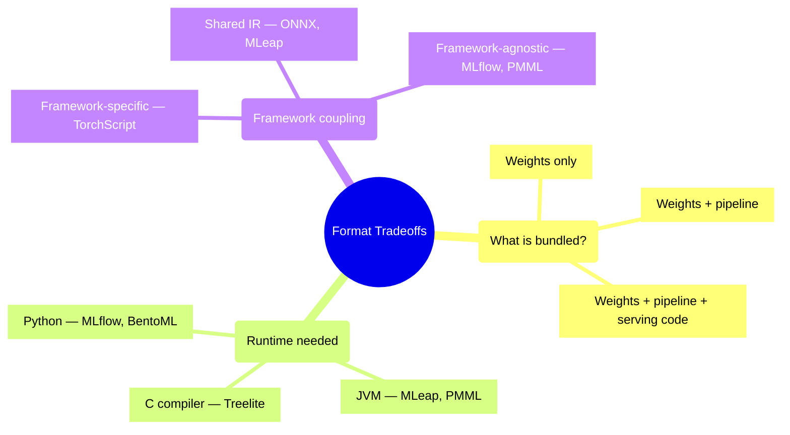
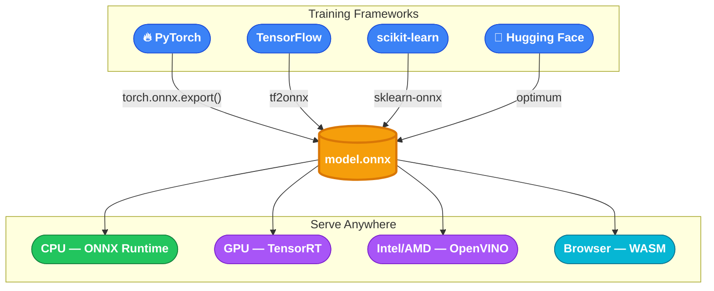
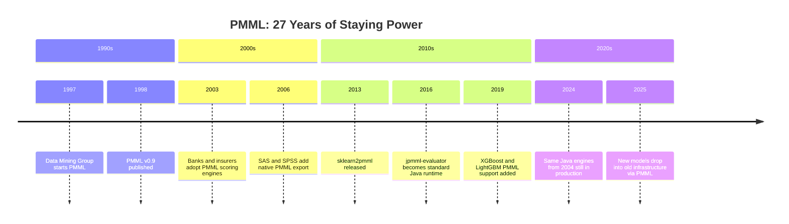
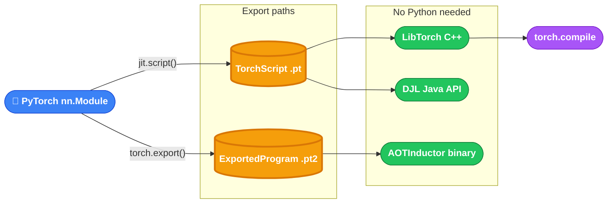
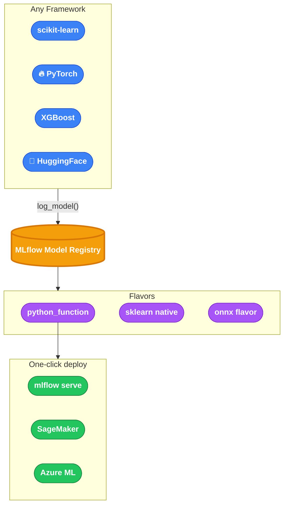
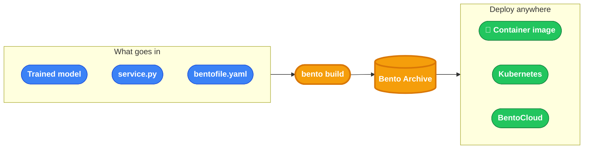
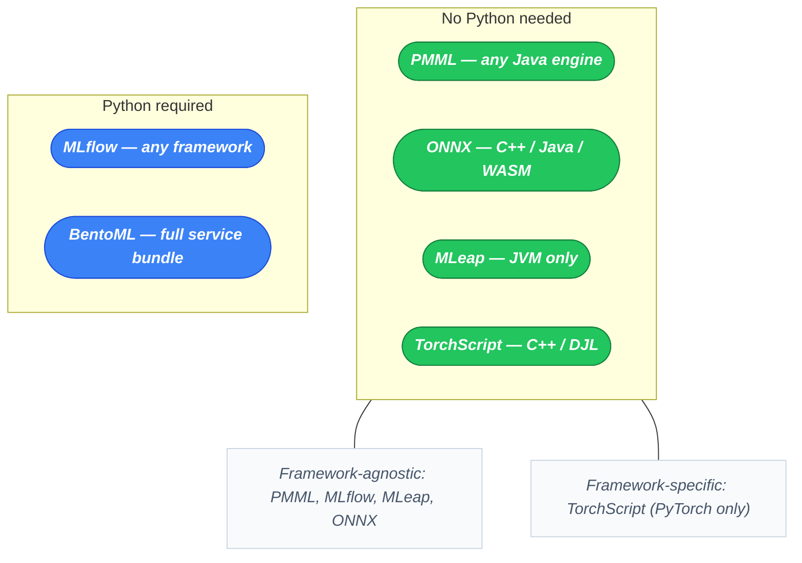

Imagine a retailer. Their data science team trains a purchase-prediction model in Python every Sunday night on a week's worth of clickstream data. By Monday morning, every visitor to the homepage gets a personalized product ranking. The scoring has to happen in under 50 milliseconds, from a Java microservice that handles millions of requests a day, with no Python anywhere in its stack.

The model works. The question is: how do you move it from a Python training environment into a Java production service without rewriting it, without breaking the preprocessing, and without the serving team needing to understand the training code?

This post is about that problem. Not a format survey, but a framework for thinking about what cross-platform model bundling actually involves, and why the choice of format shapes every downstream decision about latency, ownership, and portability.

---

## The three axes that matter

Every bundling format makes a set of tradeoffs along three axes:

**What is bundled?** Some formats carry only weights. Others bundle the full preprocessing pipeline alongside the model. Others go further and bundle the serving code, dependencies, and container configuration.

**Runtime requirement.** To run the model on a target machine, what does that machine need installed? A C compiler (Treelite) is lighter than a JVM (MLeap), which is lighter than a full Python environment (BentoML).

**Framework coupling.** Is the format tied to a specific training framework, or does it decouple training from serving?

These axes determine whether a format is the right tool for your situation. Now let's look at the formats.

---

## MLeap: Spark pipelines that leave Spark behind

MLeap was built to solve a specific problem: you have a Spark ML pipeline that does feature engineering and model inference together, and you need to run it in a service that does not have Spark.

Spark is brilliant for training. It can process petabytes of data in parallel. But running Spark to serve a single prediction in a real-time API is like hiring a road crew to change one light bulb. MLeap exists to extract the finished pipeline out of Spark so it can run in a small Java service, fast, with no cluster.

The format is a ZIP archive containing a `bundle.json` metadata file and a serialized transformer tree. The entire Spark ML pipeline (scalers, encoders, the model itself) gets serialized into either JSON or Protobuf 3, depending on the bundle version. On the other end, the MLeap runtime (a JVM library) deserializes and runs it without Spark or a cluster.

What MLeap buys you: the entire preprocessing pipeline runs with the model, in the same JVM process, with no Spark cluster dependency at serving time. The execution is fast because the MLeap runtime is a lean library, not a distributed compute framework.

In practice, a fraud detection team might train a gradient-boosted tree model with 50 Spark ML transformers: string indexers, one-hot encoders, feature assemblers, and the GBT classifier. With MLeap, the entire pipeline exports to a 2MB bundle. The fraud API (a Spring Boot Java service) loads the bundle at startup and scores thousands of transactions per second without touching Spark. When the model is retrained weekly, deployment is just swapping the bundle file.

What it does not give you: MLeap supports a defined set of transformers. If your pipeline uses a custom Spark transformer that MLeap does not know about, it cannot serialize it. The format is not general-purpose for deep learning; it is built for the tree-based and linear model world of Spark ML.

**Where it fits**: teams running Spark for feature engineering and model training who need to serve predictions in a JVM microservice without running a Spark cluster per request.

---

## ONNX: The universal IR for neural networks

ONNX (Open Neural Network Exchange) was announced by Microsoft and Facebook in late 2017 with a different goal: not to bundle pipelines, but to standardize the computational graph representation of neural networks so a model trained in any framework could be executed in any runtime.

The format is a binary Protobuf file representing a directed computation graph. Nodes are operators (MatMul, Conv, ReLU, etc.), typed with an opset version number. The opset versioning matters in practice: ONNX Runtime can run models up to the opset version it was built for, so a model exported with opset 17 will not run on an older ONNX Runtime that only understands up to opset 12.

The key selling point is the execution provider system in ONNX Runtime. The same `.onnx` file can run on a CPU server, on a GPU via TensorRT, or in a browser via WebAssembly. The switching happens at runtime, not at model export time.

This is not theoretical. Hugging Face's Optimum library exports BERT, RoBERTa, and GPT-2 to ONNX, and benchmarks consistently show 3-5x inference speedup over native PyTorch on CPU because ONNX Runtime applies graph-level optimizations (constant folding, operator fusion) that the training framework does not. Microsoft runs ONNX Runtime internally across Azure ML workloads, and Windows ML uses ONNX as its native format. On GPU servers, the TensorRT execution provider can push the same `.onnx` file through NVIDIA hardware-level fusion with no model changes. Hugging Face's Transformers.js runs BERT-class models in a browser tab using the WebAssembly execution provider.

What ONNX does not do: it handles the computation graph (the neural network) but not preprocessing pipelines. There is no canonical story for "my text tokenizer, my feature scaler, and my model, all in one portable file." The ecosystem is moving toward adding those capabilities, but today ONNX is an inference runtime for trained models, not a full pipeline bundler.

**Where it fits**: teams with deep learning models who need to deploy across different hardware targets or languages, and who are willing to manage the preprocessing step separately.

---

## PMML: The XML standard that outlasted its era

PMML (Predictive Model Markup Language) is the oldest standard on this list. The Data Mining Group began work on it in 1997; version 0.9 was published in 1998. It predates most of the modern ML tooling by over a decade.

The format is XML. A PMML file describes a model declaratively: the input schema, any data transformations, and the model structure (regression coefficients, tree split conditions, SVM support vectors). Any tool that can parse the XML and implement the execution logic can run the model.

That is both the strength and the weakness. Because it is a standard and not tied to any runtime, it works with SAS, R, legacy Java scoring engines, and open-source tools via the jpmml-* library family. Because it is XML, large tree ensembles produce enormous files. And because the standard predates deep learning, PMML has no concept of convolutional layers or attention mechanisms.

PMML matters today primarily in two situations: organizations with existing scoring infrastructure built around the standard (common in financial services and insurance), and interoperability between R/SAS-built models and Java-based production systems. Large banks and insurance companies built their credit scoring and underwriting systems in the early 2000s using Java infrastructure whose scoring engines speak PMML. A data scientist today can train a gradient-boosted tree in R or scikit-learn, export it to PMML, and drop it into a system that has been running unchanged since 2004. No containers, no Python, no Kubernetes. Just an XML file and a Java scoring engine.

If you are starting fresh with neural networks, PMML is not the answer.

**Where it fits**: legacy enterprise environments with existing PMML-compatible scoring systems, or R-to-production workflows where the consuming system speaks PMML.

---

## TorchScript and torch.export: Escaping Python

PyTorch's answer to the "my training code is Python but my production service is C++" problem is TorchScript, and more recently torch.export.

TorchScript compiles a PyTorch model to an intermediate representation that can be serialized and executed without a Python interpreter. There are two modes. `torch.jit.trace` records the execution path of a sample input, which is fast but misses control flow branches. `torch.jit.script` does static analysis of the Python code and captures branches, loops, and dynamic shapes, but requires the code to conform to a statically-typed subset of Python.

The newer `torch.export` (stable in PyTorch 2.x) is the recommended path going forward. It produces a cleaner IR with stronger soundness guarantees and handles complex models that TorchScript's tracer or scripter would fail on.

The LibTorch C++ deployment path is mature and widely used. You load the serialized model, pass it tensors, get tensors back. No Python. No Conda environment. Just C++ and the LibTorch shared library. Meta uses this path extensively: the image classification models running on Facebook's servers are compiled to TorchScript and served by C++ binaries that process billions of inferences per day.

The Deep Java Library (DJL) provides a TorchScript Java API, which means a model scripted in Python can be loaded and run from a Java microservice using the same `.pt` file. This is the path for teams in the situation described in the opener: the data science team lives in PyTorch, the production team lives in Java, and you need a handoff that does not require the platform team to install Python or maintain a sidecar Python service.

The limitation is that TorchScript requires models to conform to specific constraints, and not all PyTorch code can be scripted. Models with heavy use of Python's dynamic dispatch, `*args`/`**kwargs`, or certain third-party library calls often require manual adaptation. torch.export has a narrower execution model but is more reliable as a result.

**Where it fits**: PyTorch models that need to be deployed in C++ or JVM services where Python is not available.

---

## MLflow: The format that travels with context

MLflow takes a different philosophy. Rather than defining a new serialization standard, it defines a container format with a "flavors" system: a single MLflow model can expose multiple representations simultaneously.

The artifact is a directory. At the root is `MLmodel`, a YAML file that lists the flavors. A model logged with `mlflow.sklearn.log_model()` will have both a `sklearn` flavor (native scikit-learn pickle) and a `python_function` flavor (a generic callable). A model logged with `mlflow.pytorch.log_model()` might expose `pytorch`, `python_function`, and optionally `onnx` flavors.

The flavors system is pragmatic. Deployment tooling (MLflow's built-in server, SageMaker, Azure ML) uses the `python_function` flavor, so it works with any logged model. Teams that need direct framework access use the native flavor. The same artifact serves both needs.

What MLflow adds beyond the format itself is the model registry: versioning, aliases (champion, challenger), stage transitions, and lineage back to the experiment run that produced the model. Databricks uses MLflow Models as the standard handoff format between data science and ML engineering teams. When a data scientist finishes a training run, the model appears in the registry with version history, stage tags, and lineage back to the exact run, parameters, and dataset that produced it. The platform team deploys it without needing to know whether the model is sklearn, XGBoost, or a custom pyfunc.

The tradeoff: MLflow models require a Python runtime. If your serving infrastructure does not have Python, MLflow's serving path is not available. You would need to extract the underlying artifact and load it with its native runtime.

**Where it fits**: teams that want a unified format and model registry across multiple frameworks, and whose serving infrastructure is Python-based or cloud-hosted.

---

## BentoML: Bundling the service, not just the model

BentoML takes the furthest step along the "what is bundled" axis. A Bento archive contains the model weights, the preprocessing and postprocessing code, the Python dependencies, the serving API definition, and a generated Dockerfile.

The key architectural idea is that a Bento is not a model artifact. It is a deployable service. When you build a Bento, you specify the service class (which defines API endpoints and handles request/response transformation), the model(s), and the runtime environment. The output is something that can be containerized and deployed directly, with no additional integration work.

Multi-model scenarios are a first-class use case. A recommendation system Bento might package a retrieval model and a ranking model together, with the service code handling the two-stage logic between them. Version-control the `bentofile.yaml` and `service.py` alongside a model registry tag, and you have a complete audit trail for every deployed service version: who changed what, when, and why.

The cost is the heaviest runtime requirement on this list: Python, plus all specified dependencies. BentoML is not a format for reaching non-Python runtimes. It is a format for making Python serving code reproducible, portable, and deployable.

**Where it fits**: teams that want the full serving stack (not just the model) to be version-controlled and reproducible, and whose serving infrastructure is container-based.

---

## Choosing by axes, not by name

The formats above are not interchangeable. Each one is an answer to a different question.

> **How to read this.** The green group runs with no Python at serve time — these formats target JVM or C++ runtimes. The blue group requires Python. Within the green group, PMML/MLflow/MLeap/ONNX accept models from any training framework; TorchScript is PyTorch-specific. Positions are my own synthesis from each format's official documentation, not a third-party score.

A few patterns worth naming explicitly:

**Spark to JVM without Spark**: MLeap is the right answer. Nothing else bundles the Spark ML pipeline transformer graph in a way that is executable on a standalone JVM.

**Multi-hardware neural network deployment**: ONNX. The execution provider system is the only mature cross-hardware story for production deep learning inference.

**Legacy enterprise interop**: PMML if the consuming system already speaks it. Otherwise PMML introduces XML complexity for no benefit.

**"I want git history for my service"**: BentoML. Version control the `bentofile.yaml`, the `service.py`, and the model registry tag together, and you have a complete audit trail for every deployed service version.

**Multi-framework team with Python serving**: MLflow. The flavors system means every team can log models in their native framework, and deployment tooling does not need to know which framework was used.

---

## A note on formats that did not make the list

**GGUF** (the format used by llama.cpp) deserves a mention for LLM-specific use cases. It is a single binary file that packs quantized weights, tokenizer config, and model architecture metadata together. For running quantized open-source LLMs on CPU or consumer GPU without cloud infrastructure, it has no peer. But it is specific to LLMs and to the llama.cpp ecosystem; it is not a general-purpose deployment format.

**Treelite** compiles tree ensemble models (XGBoost, LightGBM, scikit-learn forests) to C code, which then compiles to a native shared library. The result runs on any platform with a C compiler and nothing else. For high-throughput tree model inference where Python overhead matters, it is worth knowing.

Both are narrow but excellent within their domain. The formats in the main post are the ones with general-purpose applicability across teams and organizations.

---

## References

The following primary sources were used in writing this post. All links point to official documentation or canonical repositories.

- **MLeap**: `github.com/combust/mleap` and `combust.github.io/mleap-docs`
- **ONNX**: `onnx.ai` — specification and opset versioning docs
- **ONNX Runtime**: `onnxruntime.ai/docs` — execution provider reference
- **Hugging Face Optimum**: `huggingface.co/docs/optimum` — ONNX export and benchmarks
- **ONNX Runtime Web**: `onnxruntime.ai/docs/tutorials/web` — WebAssembly deployment
- **PMML**: `dmg.org/pmml` — Data Mining Group specification (v4.1+)
- **TorchScript**: `pytorch.org/docs/stable/jit.html`
- **torch.export**: `pytorch.org/docs/stable/export.html`
- **Deep Java Library (DJL)**: `djl.ai/docs` — TorchScript Java API
- **MLflow Models**: `mlflow.org/docs/latest/ml/model`
- **MLflow Model Registry**: `mlflow.org/docs/latest/model-registry`
- **BentoML**: `docs.bentoml.com` and `github.com/bentoml/BentoML`
- **Treelite**: `treelite.readthedocs.io`
- **GGUF / llama.cpp**: `github.com/ggml-org/llama.cpp`
- **sklearn2pmml**: `github.com/jpmml/sklearn2pmml`
- **jpmml-evaluator**: `github.com/jpmml/jpmml-evaluator`
