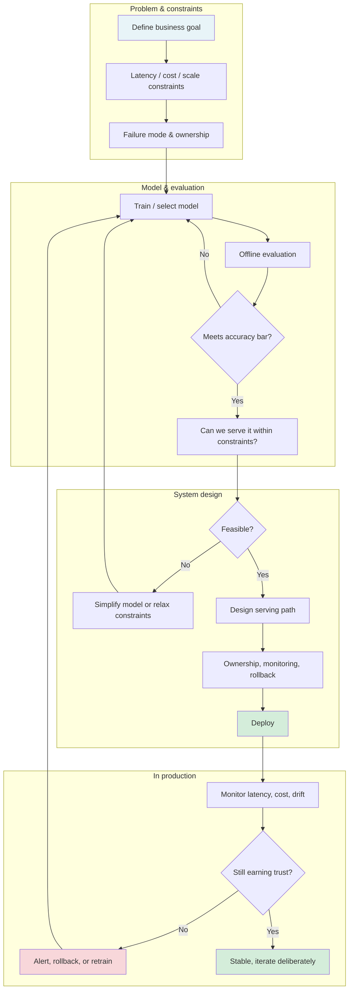

A strong model without a resilient system around it is fragile. Over time I've settled on a mental checklist for moving from "it works in a notebook" to "it works in production and keeps earning trust." This post captures that flow.

---

## The high-level flow

Every deployment decision sits inside a larger chain:

- What you optimize for first
- How you validate
- Who owns it
- How you know it's still working

The diagram below is that chain.

---

## What each stage is for

**Problem & constraints.** Before touching a model, the goal and constraints need to be explicit. What does "good enough" mean? What latency and cost are acceptable? How can this system fail, and who owns fixing it?

**Model & evaluation.** This is where accuracy and feasibility meet. A model that can't be served within latency or cost bounds isn't a production option yet. "Meets accuracy bar?" and "Can we serve it?" are both gates.

**System design.** Serving path, ownership, monitoring, and rollback aren't afterthoughts. They determine whether the system can last. If the answer to "Can we serve it?" is no, the loop goes back: simplify the model or renegotiate constraints.

**In production.** Deployment is the starting line, not the finish. Monitoring latency, cost, and drift answers: "Is this still earning trust?" If not, we alert, rollback, or retrain and re-enter the flow.

---

## Why I keep coming back to this flow

Short-term choices stack. Skip "who owns it" or "how does it fail" and it shows up later: outages, silent drift, systems no one dares change. This flow makes those choices visible. What we build can then last.

If you have a different stage or loop you always add, I'd be curious to hear how you structure it.
