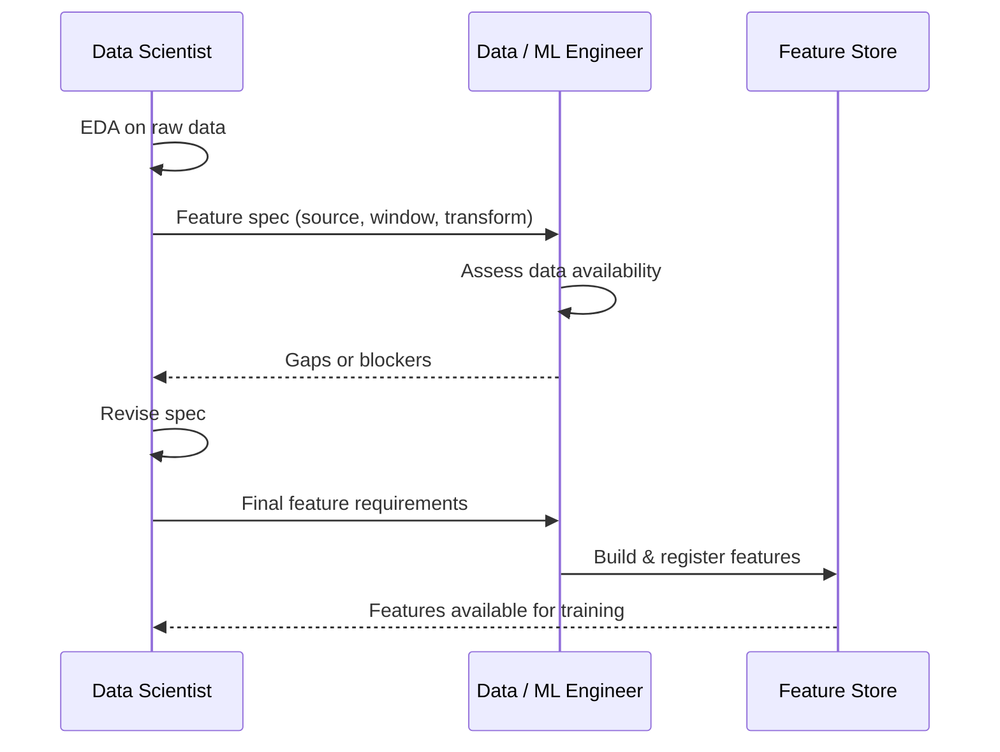
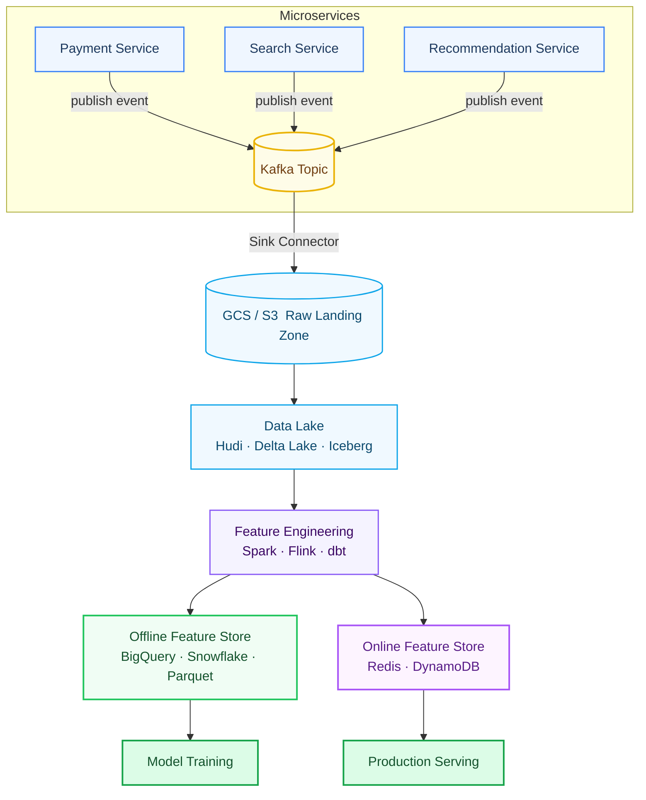
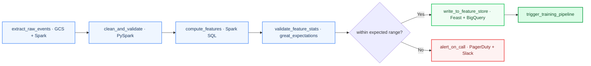
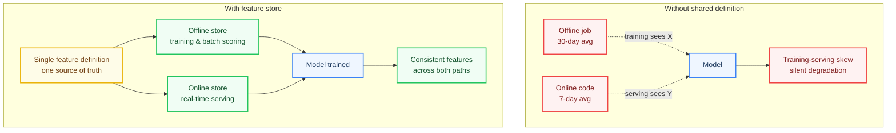

The moment a model ships, you start paying for every shortcut taken before it.

Most ML failures in production aren't model failures. They're pipeline failures. The wrong features. Features computed differently at training time versus serving time. No one owning the handoff between the data science team and the engineering team. Pipelines that worked once but weren't designed to run again.

This post is about the offline half of the ML lifecycle: how features get discovered, engineered, and automated into repeatable pipelines, and why the decisions made here directly determine what's possible in production.

---

## The two halves of the lifecycle

Before going deep, it helps to name the split clearly.

```mermaid
flowchart LR
    classDef start    fill:#dbeafe,stroke:#3b82f6,stroke-width:2px,color:#1e3a5f
    classDef process  fill:#f0fdf4,stroke:#22c55e,stroke-width:1.5px,color:#14532d
    classDef store    fill:#fefce8,stroke:#eab308,stroke-width:2px,color:#713f12
    classDef result   fill:#dcfce7,stroke:#16a34a,stroke-width:2px,color:#14532d
    classDef online   fill:#fdf4ff,stroke:#a855f7,stroke-width:1.5px,color:#581c87

    subgraph offline["  Offline  ·  Build  "]
        A[EDA & Feature Exploration]:::start --> B[Feature Requirements]:::process
        B --> C[Feature Engineering]:::process
        C --> D[(Feature Store)]:::store
        D --> E[Model Training]:::process
        E --> F[Offline Evaluation]:::result
    end

    subgraph online["  Online  ·  Serve  "]
        G[Incoming Request]:::online --> H[Feature Retrieval]:::online
        H --> I[Model Inference]:::online
        I --> J[Response]:::result
    end

    D -.->|"materialize to online store"| H
    F -->|"deploy if passes"| G
```

Everything on the left is the offline world: exploratory, batch-oriented, measured in hours or days. Everything on the right is the online world: latency-bound, always-on, measured in milliseconds.

The dotted line between them is where most of the risk lives.

---

## Stage 1: EDA and the feature handoff

It starts with data scientists doing exploratory data analysis: examining distributions, finding correlations, identifying which raw signals might carry predictive signal.

This is necessarily messy. The goal isn't a clean notebook; it's a **feature requirements document** that engineering can act on. What data sources are needed? Over what time windows? What transformations are required? What's the acceptable staleness for a feature in production?

The handoff from DS to engineering tends to fail in one of two ways:

1. **Too vague.** "We need user activity features" is not actionable.
2. **Too late.** Data scientists finish EDA and then discover the required data doesn't exist in a form that can be served in production.

Good teams front-load this negotiation. The data scientist specifies features in enough detail that a data or ML engineer can implement them, and both sides agree on what "done" means before implementation starts.

---

## Stage 2: Feature engineering, going deep

Feature engineering is where the real infrastructure work happens. You need to collect data from one or more sources, apply transformations, and make the result available for training. At scale, that's not trivial.

### The streaming path: Kafka → GCS → Data Lake

One of the most common patterns in industry starts at the microservice layer.

A payment service, a search service, a recommendation engine: all of these emit events as users interact with the product. Rather than polling databases, the cleaner approach is to have each microservice **publish events to a Kafka topic**. Kafka acts as a durable, replayable log. Nothing is lost, and multiple consumers can read from it independently.

From Kafka, a sink connector writes those messages to cloud object storage, typically GCS or S3. This is your raw landing zone: unprocessed, append-only, cheap to store.

The data lake layer (Apache Hudi, Delta Lake, or Apache Iceberg) sits on top of raw object storage and adds structure: schema enforcement, time-travel queries, efficient upserts. This is where raw logs become queryable tables.

From the data lake, feature engineering happens. Typically Apache Spark for batch transformations, Apache Flink for streaming aggregations. This is where you compute the features the data scientists specified: rolling averages, count-based features, categorical encodings, time-windowed aggregations.

### Who does this work?

It depends on team maturity.

At early-stage companies or ML teams without dedicated data engineering support, ML engineers often own the full stack: Kafka sink configuration, Spark jobs, and feature validation. At larger organizations, data engineering teams own the pipeline infrastructure and ML engineers own the feature definitions.

The trend across the industry has been toward **declarative feature frameworks** that let ML practitioners express *what* a feature means without having to implement the infrastructure that computes it.

### Industry examples worth knowing

**Uber's Michelangelo** is one of the most cited examples of a mature ML platform. Their feature store, Palette, hosts tens of thousands of production features shared across teams. Features are expressed in a DSL (a subset of Scala) that gets compiled to bytecode, ensuring consistent execution whether the feature is computed offline for training or online at serving time. This compilation step is the key to eliminating training-serving skew.

**Airbnb's Chronon** (originally Zipline) takes a unified approach: you define a feature once, and the framework handles batch computation, streaming computation, and online serving. It's been open-sourced and adopted beyond Airbnb. The core idea is that the same definition powers all three modes, which is exactly what you want to prevent skew.

**DoorDash's Riviera** is built on Apache Flink and takes a declarative, configuration-driven approach to real-time feature pipelines. Instead of writing native Flink applications, engineers specify feature transformations in configuration, and the framework handles execution. The result is that features are accessible, reusable, and isolated from one another. Three properties that are hard to maintain in hand-rolled streaming code.

**LinkedIn's Feathr** (open-sourced) introduces the concept of producers and consumers. Feature producers register features against raw data sources; feature consumers simply list what features they need. The framework figures out how to provide them. It also bakes in **point-in-time correctness**, ensuring that when you generate a training dataset, you only use feature values that would have been available at the time of each training example. This is critical for preventing data leakage.

**Meta's FBLearner** ingests and processes trillions of data points daily, trains models across a huge breadth of use cases, and makes predictions at a rate that requires distributed infrastructure at an extraordinary scale. Their feature store acts as a marketplace: teams publish features, others discover and reuse them rather than recomputing from scratch.

---

## Stage 3: Automating the pipeline

Once you've built a feature pipeline that works once, the next question is: can you run it again reliably?

This is where orchestration comes in.

### Apache Airflow

The most widely deployed orchestration tool for data pipelines. Workflows are expressed as **DAGs (Directed Acyclic Graphs)** in Python. Each node is a task, each edge is a dependency. Airflow handles scheduling, retries, dependency management, and provides a UI for monitoring.

A typical feature pipeline DAG might look like:

Each task is idempotent. Running it twice produces the same result. This is a requirement, not a nicety: if a task fails halfway through, you need to be able to rerun it safely.

### Alternatives worth knowing

**Flyte** (originally from Lyft, now open-source) takes a more ML-native approach. Workflows are Python functions decorated with type annotations. The framework uses the type information to validate data passing between tasks, catch errors early, and cache task outputs for efficient reruns. It's Kubernetes-native and well-suited to ML-specific workloads that involve multiple compute frameworks.

**Metaflow** (from Netflix) is designed for data scientists first. You write a `Flow` class in Python, decorate steps with resource requirements, and Metaflow handles execution locally or at scale on cloud infrastructure. It's notable for how seamlessly it moves from notebook prototyping to production runs.

**Kubeflow Pipelines** is the Kubernetes-native option, built for teams already running on Kubernetes who want ML pipelines that integrate with that infrastructure directly.

The choice between these isn't purely technical. It reflects how a team is organized. Airflow tends to win in data-engineering-heavy teams with existing workflow infrastructure. Flyte and Metaflow tend to win in ML-first teams that want to move fast without managing infrastructure.

---

## The connection to serving: where offline decisions show up in production

Here's the uncomfortable truth: every shortcut in the offline pipeline becomes a problem in production.

The most common failure mode is **training-serving skew**: the model sees different feature values during training than it sees at inference time. This can happen because:

- A feature was computed one way in the training job and re-implemented (differently) in the serving path
- The time window used offline doesn't match what's available online
- Null values were handled differently in the two paths
- The offline pipeline processed data at day granularity; the online store updates every 15 minutes

The fix is conceptually simple: define features once and reuse that definition for both training and serving. In practice this requires a feature store, or at minimum a very disciplined codebase where the training feature logic and serving feature logic are the same code.

This is why feature stores like **Feast**, **Tecton**, and **Hopsworks** exist. Not primarily for discovery or governance (though they help there), but to enforce a single point of definition that both offline training and online serving read from. Eliminate the skew at the source.

---

## What this means structurally

If I step back from the technical details, the pattern across companies is consistent:

1. **The DS↔Eng handoff is a contract, not a conversation.** Feature requirements need to be specific enough that they can be implemented, validated, and reproduced.

2. **Feature engineering is infrastructure work.** It belongs in version control, it needs tests, it needs runbooks. A Jupyter notebook that ran once is not a feature pipeline.

3. **Automation makes it real.** An Airflow DAG or Flyte workflow that runs on a schedule, validates outputs, and alerts on failure is the difference between a feature pipeline and a one-time experiment.

4. **The offline-online boundary is where the risk concentrates.** Every place where offline and online logic diverge is a place where skew can grow silently.

The companies that get this right, and there are clear examples in how Uber, Airbnb, LinkedIn, and others have published about their platforms, invest heavily in making the offline-to-online path a single, consistent definition rather than two codebases that were *supposed* to match.

That investment pays off not at training time, but months later, when the model is still behaving as expected in production.

---

*Part 2, Powering Models: Feature Engineering, Part 2, covers the online half: how features are made available to production services, the choice between request-time feature passing and online feature store retrieval, and what that decision means for latency, consistency, and operational complexity.*
