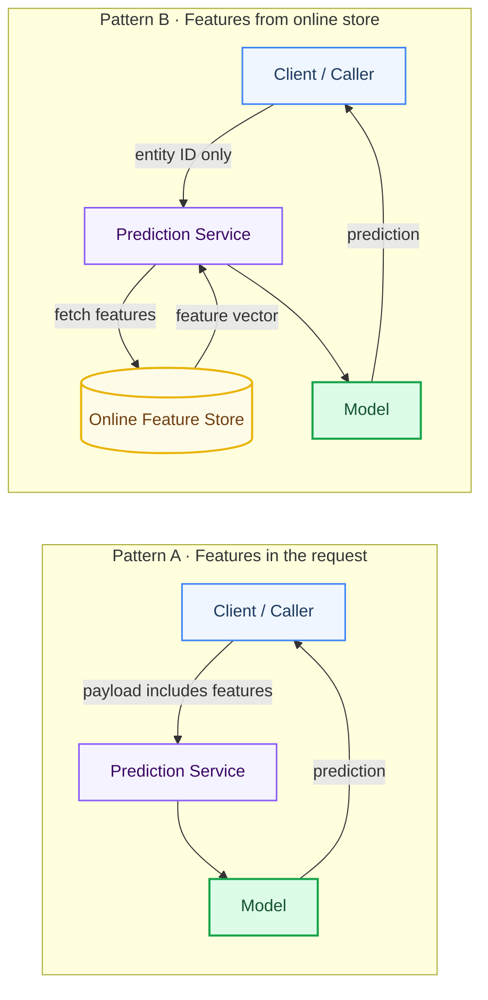
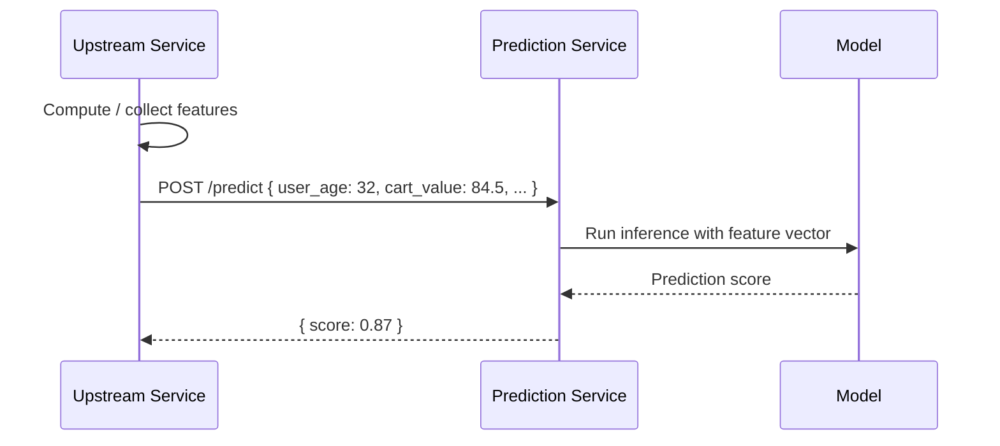
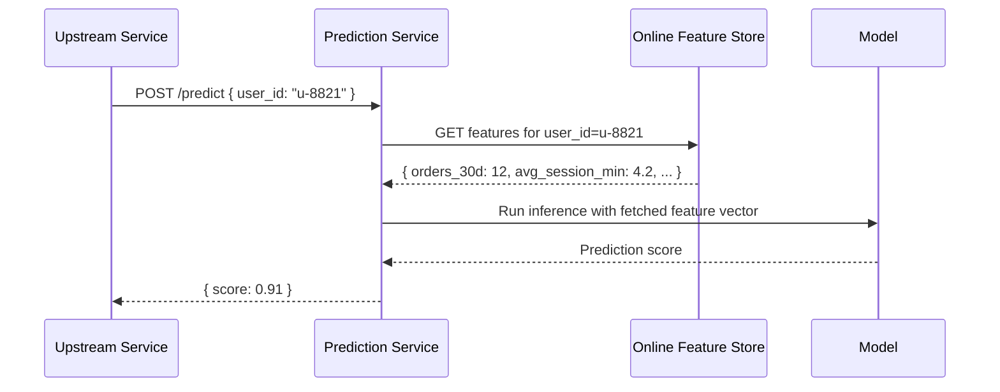
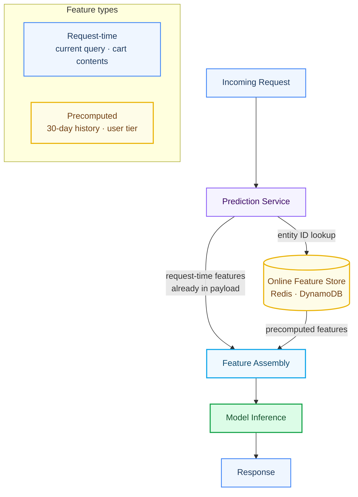
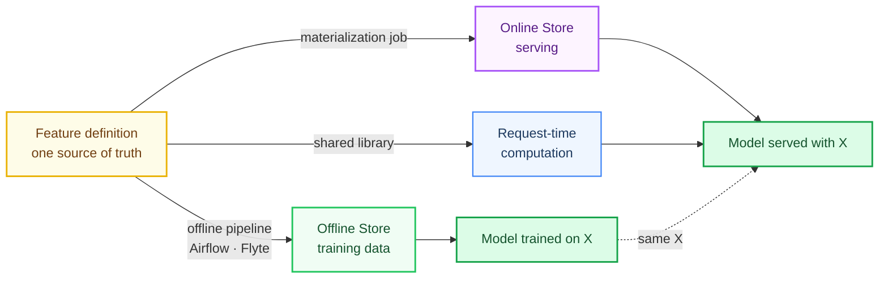

Part 1 covered the offline side: getting features built, validated, and automated. This post picks up at the point where a model is deployed and a service needs to call it.

The question is deceptively simple: how does the model get the features it needs when a request comes in?

There are two answers, and most real systems use both depending on the feature type.

---

## The two patterns

**Pattern A** puts the burden on the caller. The upstream service computes or collects the features and sends them as part of the request payload.

**Pattern B** puts the burden on the prediction service. The caller sends an entity identifier (a user ID, a product ID, a session ID), and the prediction service fetches the features itself from an online store.

Neither is universally better. The right choice depends on what the feature is, where it lives, and what the latency budget looks like.

---

## Pattern A: Features in the request

This is the simpler path operationally. The caller owns the features. The prediction service receives them, runs the model, and returns a result.

### When it works well

**Request-context features.** Some features only exist at request time and cannot be precomputed. The current search query. The item a user just clicked. The contents of a shopping cart right now. These aren't things you can store in advance; they exist only in the moment.

**Low cardinality or stateless features.** If the feature set is small, easy to compute, and doesn't require historical aggregation, passing it in the request is the cleanest approach. No external dependency at inference time, no cache to warm, no staleness to manage.

**Internal microservice calls.** If the prediction service is called by another internal service that already has the necessary context, that service can pass features directly. No feature store lookup needed.

### Where it breaks down

**Stale or inconsistent features.** If the caller computes features differently from how they were computed at training time, you reintroduce training-serving skew through the back door. Different services calling the same prediction endpoint can compute "the same" feature in subtly different ways.

**Feature sprawl.** As models evolve and feature sets grow, keeping the request schema in sync across callers becomes a coordination problem. Adding a new feature requires updating every upstream service simultaneously.

**Historical aggregations.** Features like "number of orders in the past 30 days" or "average session duration over the past 7 days" can't reasonably be computed by the caller on every request. They need to be precomputed and stored somewhere.

---

## Pattern B: Online feature store retrieval

Here the prediction service takes on the responsibility of fetching features. The caller only needs to provide a stable entity identifier, and the service handles the rest.

The online feature store is a low-latency key-value store, typically Redis, DynamoDB, or a purpose-built system like Feast's online layer or Tecton's serving layer. Features are keyed by entity ID and written there by the offline pipeline (or a streaming pipeline for near-real-time updates).

### When it works well

**Precomputed aggregations.** Rolling windows, historical counts, user-level statistics. These are expensive to compute on the fly and well-suited to precomputation. The offline pipeline writes them; the online store serves them.

**Feature reuse across services.** A user's risk score, lifetime value tier, or engagement features are useful to multiple services. Rather than each service independently computing (and inevitably diverging on) these features, they all read from the same store.

**Consistency guarantee.** Because the feature is defined once and materialized to both the offline store (for training) and the online store (for serving), you get the same value in both contexts. This is the direct solution to training-serving skew.

**Decoupling callers from feature logic.** The upstream service doesn't need to know anything about how features are computed. It passes an entity ID. Feature computation changes are invisible to it.

### Where it breaks down

**Latency budget.** A feature store lookup adds a network round-trip. For p99 latency-sensitive services, this can be a problem. Teams mitigate this with co-location (running the feature store close to the prediction service), connection pooling, and batched lookups.

**Staleness.** Online stores hold the last materialized value of a feature. If your offline pipeline runs daily, your online features are up to 24 hours stale. For features where recency matters, this requires either a streaming update path or accepting the staleness as a known tradeoff.

**Operational complexity.** Now you have a production dependency on a feature store with its own availability SLA. An outage in the feature store affects the prediction service. This requires fallback strategies: default values, cached local copies, or graceful degradation.

---

## How the two patterns combine in practice

Production systems rarely use just one pattern. The common approach is to segment features by type and apply the right pattern to each.

A concrete example: a product recommendation model might receive the current search query and the items in the user's cart from the request payload (Pattern A), while fetching the user's historical purchase categories and engagement tier from the online store (Pattern B). The prediction service assembles both into the final feature vector before calling the model.

This hybrid approach is documented in how several large systems work. Uber's Michelangelo separates context features (passed in the request) from entity features (fetched from a feature store) as a first-class architectural distinction. The request carries what the caller knows right now; the store carries what the system has accumulated over time.

---

## The feature contract

Whichever pattern you use, what matters is that the features the model sees at serving time are the same features it was trained on. Not approximately the same. Not computed with similar logic. The same.

This means:

**If you use Pattern A**, the caller must compute features using the same logic that was used to generate training data. This is easier to guarantee when the caller is a single internal service and harder when features are computed across multiple teams.

**If you use Pattern B**, the online store must be populated from the same feature definitions used to generate the training dataset. Modern feature stores enforce this by using a single definition for both offline materialization and online serving.

**If you mix both**, the feature assembly step (merging request-time and store-fetched features) must be consistent and testable. It's worth treating this as a code module with its own tests, not an ad-hoc step inside the prediction handler.

The diagram above is the ideal. One definition, three materialization paths, one guarantee: training and serving see the same data.

---

## Practical considerations when choosing

A few questions that tend to drive the decision in real systems:

**Does the feature require historical data?** If yes, Pattern B. You cannot compute a 30-day rolling average at request time without a precomputed store.

**Is the feature only available at request time?** If yes, Pattern A. Current session context, the item being viewed, the query being typed: these don't exist until the request arrives.

**How many services call this model?** If many, Pattern B reduces the coordination surface. Each caller doesn't need to independently implement feature logic.

**What's your latency budget?** If sub-10ms end-to-end is a hard requirement, a feature store round-trip may not fit. Pattern A (or a local cache) keeps the lookup off the critical path.

**How often do features change?** Slowly-changing features (user demographic tier, long-term engagement level) are well-suited to precomputation. Rapidly-changing features (current cart value, last click) need either request-time passing or a streaming update path to the online store.

---

## What this means for system design

The pattern you choose isn't just a technical detail. It determines who owns what, where errors appear, and what breaks when things go wrong.

With Pattern A, feature bugs show up as caller bugs. The prediction service is correct; the upstream service passed the wrong value.

With Pattern B, feature bugs show up as store bugs. The caller is correct; the materialization pipeline wrote stale or incorrect data.

In both cases, the model is correct. It did exactly what it was trained to do. The failure is in the surrounding system.

This is why the offline work in Part 1 matters so much: the quality of the features in the online store is only as good as the pipeline that built them. Garbage-in at the offline stage becomes silent degradation at the online stage, often weeks or months later.

Getting the feature pipeline right, and getting the serving pattern right, are the same problem viewed from opposite ends of the lifecycle.

---

*This is Part 2 of a two-part series. Part 1, Powering Models: Feature Engineering, Part 1, covers EDA and the DS to engineering handoff, the Kafka to GCS to data lake pipeline, and orchestrating repeatable feature workflows with Airflow, Flyte, and Metaflow.*
