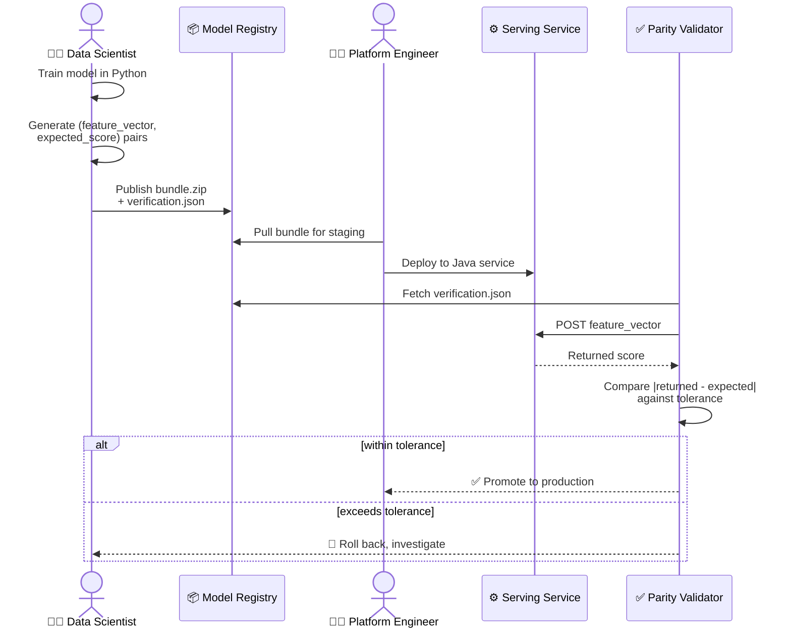
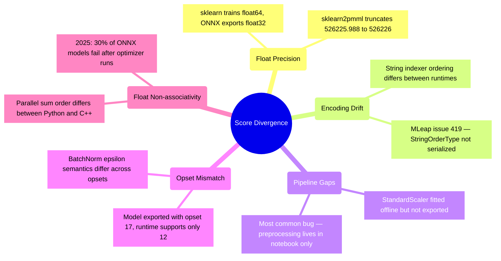
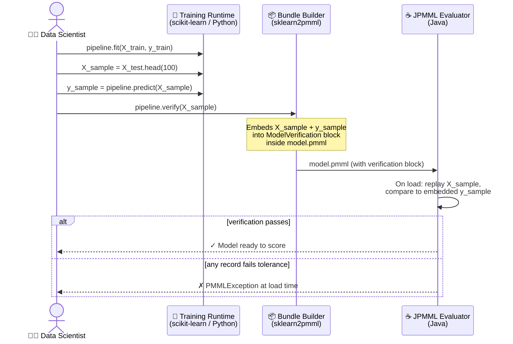
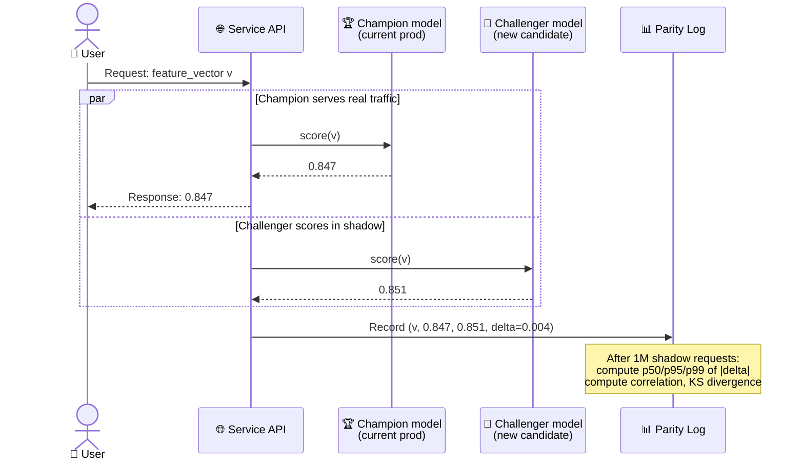
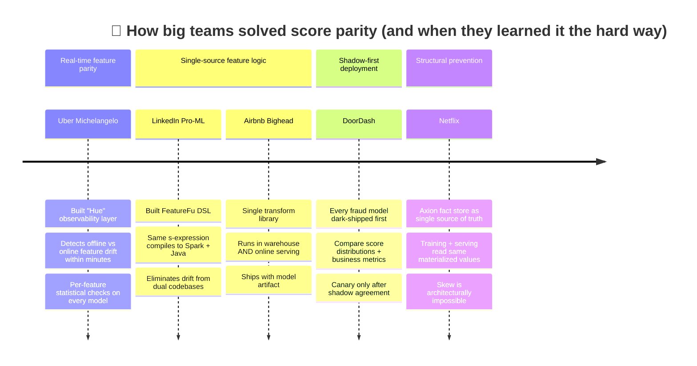
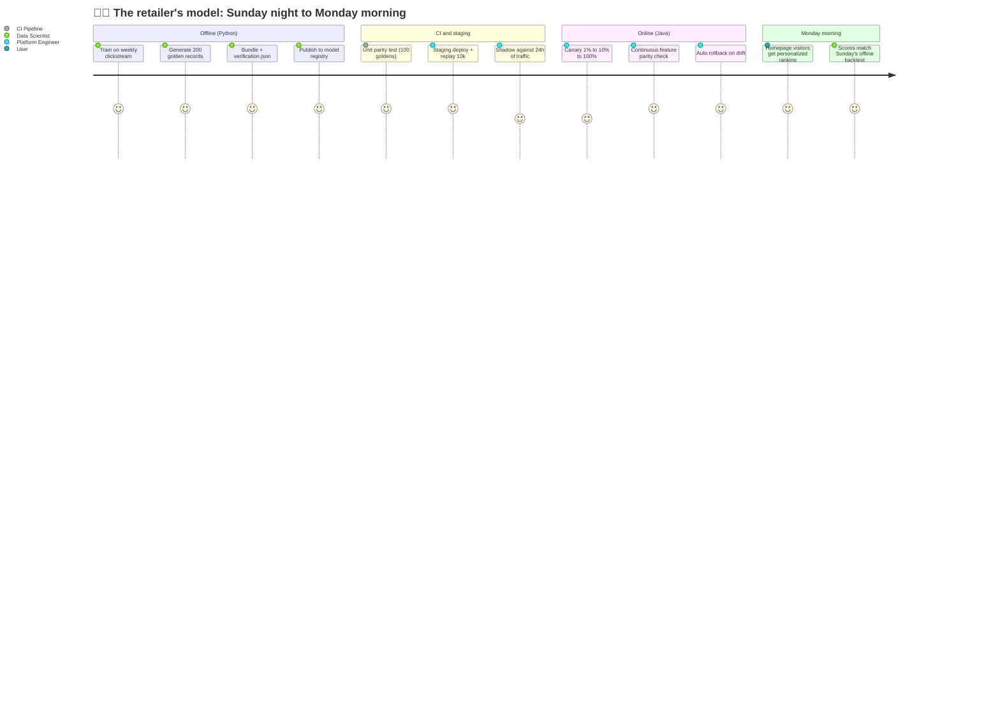

[Part 1](https://gvarchala-pixel.github.io/post/cross-platform-model-bundling/) ended with a retailer moving a purchase-prediction model from Python training into a Java serving service. The bundle was clean. The service loaded it. Scores came back.

But here is the question that decides whether the project ships or stalls: are those scores actually right?

The Python notebook says feature vector `v` scores `0.847`. The Java service, given the same `v`, returns `0.846989`. Close, but not identical. Should the team ship it? What if it returned `0.83`? Or `0.5`?

This post is about that gap and how teams close it. It covers the handshake between offline and online, the sample records that prove the bundle traveled without breaking, and what to do when scores do not match.

---

## What parity actually means

In ML infrastructure this problem has several names: **inference parity**, **score parity**, **training-serving consistency**. The technique used to verify it is sometimes called **shadow scoring** or **golden-record validation**. The requirement is simple:

> For the same feature vector, the offline training environment and the online serving environment must produce scores that are either identical (for tree-based models) or within a defined numerical tolerance (for models involving floating-point matrix operations).

A model that fails parity is worse than no model. It is a model you trust, deploy, and build product decisions around, while it silently scores everyone wrong.



The handshake is two-sided. The data scientist publishes not only the model artifact but also a small bundle of representative input vectors and the scores those vectors produced on the training-time runtime. The serving system, once loaded, must regenerate those scores within tolerance before any real traffic touches it.

This single discipline catches the entire class of "the model deployed but something is off" production incidents that ML teams quietly accumulate.

---

## Why scores diverge: a tour of the failure modes

Before describing the validation patterns, it helps to understand why a model can produce different scores in two environments even when the artifact is byte-for-byte identical.



**Float precision.** `sklearn-onnx` defaults to single-precision floats because GPU runtimes prefer float32 for deep learning. But scikit-learn trains in float64. For tree thresholds the difference is dangerous: a documented [sklearn2pmml issue #9636](https://github.com/jpmml/sklearn2pmml/issues/9636) filed against the jpmml/sklearn2pmml repository shows a tree split at `526225.988222` being truncated to `526226` in the exported PMML. Every record where the feature equals `526225.99` now routes to the wrong child of the tree. For a single tree the impact is small. For an Isolation Forest with 100 trees, anomaly scores diverge for thousands of records. The root cause is float32 mantissa exhaustion: 32-bit floats have 24 bits of significand precision, which runs out for values in the hundreds of thousands.

**Encoding drift.** Spark's `StringIndexer` orders categories by frequency. Spark 2.3 introduced a `StringOrderType` parameter to control this ordering. If MLeap fails to serialize that parameter (documented in [combust/mleap issue #419](https://github.com/combust/mleap/issues/419), present in older MLeap versions), the Java runtime falls back to its own default ordering. The feature `country=US` might map to index 3 offline and index 5 online. The model weights remain unchanged. Every score is wrong.

**Null handling.** Pandas treats `NaN` as a missing-value sentinel. Java treats `null` differently from `NaN`. A feature that is `NaN` in training (imputed by the scaler to the column mean) and `null` in serving (passed through as zero) gives the model two different inputs for the same logical record.

**Pipeline gaps.** The single most common parity bug is a preprocessing step that lives in the training notebook but is not bundled with the model. `StandardScaler.fit_transform()` ran offline; only the model weights get exported. At serve time, raw features arrive at a model that expects standardized inputs.

**Opset mismatch.** ONNX uses opset versions to evolve operator semantics. A model exported with opset 17 cannot run correctly on a runtime that only supports opset 12. Some operators (Resize, Softmax, BatchNormalization) have subtle precision differences across opset versions, so a model that loads on the wrong runtime can still produce silently wrong scores.

**Floating-point non-associativity.** `(a + b) + c` does not always equal `a + (b + c)` in floating-point arithmetic. Parallel reductions sum elements in different orders, and the cumulative rounding produces different results. A March 2025 paper, [*Understanding and Mitigating Numerical Sources of Nondeterminism in LLM Inference*](https://arxiv.org/abs/2506.09501), showed that FP32 is near-perfectly deterministic but BF16 can produce different outputs between runs of the same model on the same input, simply because operator fusion changes the order of additions.

The most striking recent measurement comes from the 2025 paper [*OODTE: A Differential Testing Engine for the ONNX Optimizer*](https://arxiv.org/abs/2505.01892v2): **30% of classification models** showed different outputs after the ONNX Optimizer ran its standard passes, **16.6%** of object-detection and segmentation models failed parity tests, and **9.2%** either crashed the optimizer or produced invalid models. Fifteen separate issues were filed against the ONNX Optimizer as a direct result of this study, fourteen of them previously unknown.

Cross-platform parity is not a property you get by default. It is a property you have to actively verify.

The ONNX Optimizer runs a set of graph-optimization passes before deployment. Louloudakis & Rajan (2025) tested those passes against real production models and found significant silent failures:

| Model category | % failing parity after optimizer |
|---|---|
| Classification | **30%** |
| Object Detection | **16.6%** |
| Segmentation | **16.6%** |
| Crashed or invalid output | **9.2%** |

In plain terms: nearly 1 in 3 classification models produced different scores after the ONNX Optimizer ran, compared to the unoptimized version. The models loaded successfully — they just scored differently. Without a parity test, you would never know.

> **Source:** Louloudakis & Rajan, [*OODTE: A Differential Testing Engine for the ONNX Optimizer*](https://arxiv.org/abs/2505.01892v2), arXiv:2505.01892, May 2025. The study tested 47 ONNX optimization passes against a corpus of real production models, comparing outputs before and after optimization. Percentages are from Table 1. The "Crashed/Invalid" category counts models where the optimizer produced a structurally broken output or threw an unhandled exception.

---

## Pattern 1: Golden records (the verification handshake)

The cleanest implementation embeds verification data into the bundle itself.



This is exactly what `sklearn2pmml.PMMLPipeline.verify(X)` does. It takes a representative sample of inputs, runs the model on them in the Python runtime, and writes both the inputs and the resulting scores into a `<ModelVerification>` block inside the PMML XML. When JPMML-Evaluator loads the model in Java, the very first thing it does is replay the verification data and confirm that its scores match what Python recorded. If any record drifts beyond tolerance, the load throws. The model never enters service.

For MLeap, the equivalent is `mleap-spark-testkit`'s `SparkParityBase`: a Scala test fixture that loads the same pipeline through Spark and through the MLeap runtime, runs both on a verification dataset, and asserts equality. The MLeap project itself uses `SparkParityBase` to maintain parity coverage across every built-in transformer.

For ONNX the path is two steps: `onnx.checker.check_model()` validates the graph and opset, then PyTorch's `torch.onnx.verification` module runs a sample input through both the PyTorch model and the exported ONNX model, reporting the max absolute difference, max relative difference, and a histogram of per-element deltas.

The pattern across all three: **representative inputs and expected outputs, traveling with the model, replayed at load time.**

---

## Pattern 2: Shadow scoring (parity against live traffic)

Golden records prove the bundle traveled without breaking. They do not prove the bundle behaves well on the actual distribution of production traffic. For that, teams shadow-score.



DoorDash uses this pattern for fraud detection models, calling it "dark shipping": every new fraud model is wired into the request path in parallel with the production model, but its scores are logged rather than acted upon. Only after the shadow stream shows consistent agreement with the production model does the canary rollout begin.

AWS SageMaker offers shadow testing as a managed capability: the platform splits traffic so a variant endpoint receives a copy of every request, scores it, and emits per-request comparison metrics, without the variant's responses ever reaching the user.

Uber's Michelangelo team built an internal system called Hue that goes a layer deeper. Hue checks not just final scores but feature-by-feature parity between the offline feature store (used at training time) and the online feature store (used at serve time), so a divergence can be traced to its source: was it the model runtime, or was it an upstream feature that disagreed?

The advantage of shadow scoring over golden records is coverage. Golden records are static and curated; shadow scoring uses real production data including the long tail of unusual feature values no one thought to include in the verification set.

---

## Pattern 3: Statistical tolerance bands

"Identical" is the wrong target for any model that does floating-point math. The right target is a tolerance band, set per model type and validated continuously.

| Model type | Max absolute delta | Max relative delta | Min correlation |
|---|---|---|---|
| Tree ensembles (XGBoost, RF, GBT) | 0 (exact) | 0% | 1.0 |
| Classification probabilities | 1e-5 to 1e-4 | 0.1% to 1% | > 0.999 |
| Continuous regression | 1e-6 to 1e-5 | 1e-5 to 1e-4 | > 0.9999 |
| Ranking / recommendations | n/a | Top-10 overlap > 95% | n/a |
| Deep learning (FP32) | 1e-5 | 1e-4 | > 0.999 |
| Deep learning (BF16) | 1e-2 | 1% to 5% | > 0.99 |

The reasoning:

**Trees should be exact.** Tree inference is comparisons, not arithmetic. If a tree-based model is non-identical across runtimes, something in encoding or precision is wrong and needs to be found, not tolerated.

**Probabilities can wobble.** A logistic regression returning `0.84700` vs `0.84689` makes the same classification at any sensible threshold. A 1% relative tolerance absorbs this without hiding real bugs.

**Ranking metrics matter more than raw scores.** For a recommender, what matters is the top-K set. Two systems can produce different raw scores and still agree on the top 10 items. Validate the metric the product actually uses.

The numerical libraries have well-named knobs for this: `numpy.allclose(a, b, atol=1e-6, rtol=1e-5)`, PyTorch's `torch.allclose`, ONNX's `TEST_ATOL` and `TEST_RTOL` environment variables, MLflow's `validate_evaluation_results()` with explicit `threshold`, `min_absolute_change`, and `min_relative_change` parameters.

> **Where these tolerances come from.** The values in the table above are synthesized from three primary sources: the default tolerances used in ONNX's own test suite (documented at `github.com/onnx/onnx-mlir/blob/main/docs/Testing.md`), the sklearn-onnx precision analysis published at `onnx.ai/sklearn-onnx/auto_tutorial/plot_ebegin_float_double.html`, and the openscoring.io benchmarks comparing scikit-learn and JPMML-Evaluator output at `openscoring.io/blog/2021/08/04/benchmarking_sklearn_jpmml_evaluator`. The BF16 tolerance reflects the non-determinism findings from the 2025 paper cited above. These are starting points, not hard rules — your own model's tolerance should be validated empirically against a holdout set before you commit to a number.

---

## Pattern 4: CI/CD as the parity gate

The three patterns above are tools. Putting them into a pipeline is the discipline that makes them stick.

```mermaid
flowchart LR
    classDef build  fill:#3b82f6,stroke:#1d4ed8,color:#fff,font-weight:bold
    classDef gate   fill:#ef4444,stroke:#b91c1c,stroke-width:2px,color:#fff,font-weight:bold
    classDef pass   fill:#22c55e,stroke:#15803d,color:#fff,font-weight:bold
    classDef warn   fill:#f59e0b,stroke:#d97706,color:#fff,font-weight:bold

    TRAIN(["🧪 Train + generate goldens"]):::build
    BUILD(["📦 Build + embed verification"]):::build
    UNIT{{"🔬 Unit parity test"}}:::gate
    STAGE(["🚦 Staging + replay 10k"]):::warn
    SHADOW{{"👥 Shadow — 1M live requests"}}:::gate
    CANARY(["🐤 Canary: 1% → 10% → 100%"]):::pass
    PROD(["🏁 Production"]):::pass
    FAIL(["🚨 Block + page owner"]):::gate

    TRAIN --> BUILD --> UNIT
    UNIT  -->|"✅ within tolerance"| STAGE
    UNIT  -->|"❌ fail"| FAIL
    STAGE --> SHADOW
    SHADOW -->|"✅ p99 delta ok"| CANARY
    SHADOW -->|"❌ fail"| FAIL
    CANARY --> PROD
```



Every stage has an explicit pass-or-fail signal, and the failure paths never reach production. The retailer's CI pipeline runs `pipeline.verify()` against a fixed 100-record sample in unit tests. Staging replays a 10,000-record sample. Shadow scoring runs against 24 hours of mirrored traffic. Canary release ramps from 1% to 10% to 100% over a day, with auto-rollback if the live score distribution drifts beyond the configured threshold.

The cost of building this is real. The cost of not building it is the production incident where a model has been silently wrong for three weeks.

---

## A worked example: the retailer's parity check

Here is what the retailer's first parity test looks like end to end.

**Python side, after training:**

```python
import json

# Pick 200 representative records from the holdout set.
X_verify = X_test.sample(n=200, random_state=42)
y_offline = pipeline.predict_proba(X_verify)[:, 1]

# Serialize inputs and expected scores together.
bundle = {
    "model_version": "purchase_predictor_v1.3.0",
    "exported_at": "2026-05-15T10:00:00Z",
    "feature_schema": list(X_verify.columns),
    "samples": X_verify.to_dict(orient="records"),
    "expected_scores": y_offline.tolist(),
    "tolerance": {"atol": 1e-5, "rtol": 1e-4}
}
with open("verification.json", "w") as f:
    json.dump(bundle, f)
```

**Java side, at service startup:**

```java
public class ParityChecker {
    public boolean validateOnLoad(MleapModel model, VerificationBundle bundle) {
        double atol = bundle.tolerance.atol;
        double rtol = bundle.tolerance.rtol;
        int failures = 0;

        for (int i = 0; i < bundle.samples.size(); i++) {
            LeapFrame input = bundle.samples.get(i);
            double expected = bundle.expectedScores.get(i);
            double actual = model.transform(input).select("probability").getDouble(0);
            double delta = Math.abs(actual - expected);
            double bound = atol + rtol * Math.abs(expected);

            if (delta > bound) {
                log.error("Parity failure on sample {}: expected={}, actual={}, delta={}, bound={}",
                          i, expected, actual, delta, bound);
                failures++;
            }
        }
        if (failures > 0) {
            throw new ModelLoadException(
                "Parity check failed on " + failures + "/" + bundle.samples.size() + " records"
            );
        }
        return true;
    }
}
```

The Java service refuses to start if a single one of the 200 records fails. The CI pipeline refuses to promote a model that does not pass on staging. When parity does break, the failing record is logged with both the expected and actual scores. The data scientist and the platform engineer look at the same number and have a reproducible disagreement to debug.

---

## What the big platform teams learned

These patterns were paid for in production outages.



**Uber Michelangelo.** Michelangelo's first generation served Spark `PipelineModel` artifacts directly from a JVM runtime. By the time the platform ran thousands of production models, the team realized feature-level parity had to be monitored separately from model-level parity. They built Hue, an observability layer that flags within minutes if the offline value of a feature drifts from the online value the model is actually consuming. The model can be perfectly bundled and still be wrong, because the feature it scored on at training time is not the feature it sees at inference time.

**LinkedIn Pro-ML.** LinkedIn's recommendation infrastructure runs hundreds of models maintained by dozens of teams, with distinct codebases for offline feature engineering (Spark) and online feature serving (Java). Their answer was FeatureFu, an open-source DSL that expresses feature transformations as Lisp-like s-expressions compiled to both execution paths. The class of parity bug caused by "the Python code and the Java code drifted apart over six months of feature changes" stops being possible when the same expression runs on both sides.

**Airbnb Bighead.** Bighead's design explicitly called out training-serving skew as the primary motivation for the platform. Their solution is a single feature transformation library that handles both multi-row aggregation (warehouse) and single-row transformation (online serving). Same code path. The platform packages it with the model artifact and ships both to the Deep Thought serving environment.

**DoorDash.** The DoorDash fraud team documented their dark-shipping pattern: every new fraud model runs in shadow mode against live traffic for an extended period, with engineers comparing both score distributions and downstream business metrics (transaction approval rates, dispute counts) between shadow and live paths. Only after the comparison shows agreement does any decision authority transfer to the new model.

**Netflix.** Netflix's Axion fact store sits between the warehouse and the model. Both training jobs and serving services read features from Axion, so the values are by construction identical. The "feature in training was different from feature in serving" failure mode is structurally prevented rather than monitored after the fact.

The common thread: every one of these teams discovered, the hard way, that the model artifact is only one of three things that need to be consistent across offline and online. The other two are the features the model consumes and the data those features are computed from.

---

## The full lifecycle



The handshake is the thing that turns "the model bundled cleanly" into "the model is correct in production." It is small in code, large in consequence, and almost never described as a first-class deliverable in ML tutorials.

Part 1 was about how to move the model across runtimes. This post is about how to prove the move worked. The next post in this series will tackle the third piece: how to monitor a deployed model so that when its behavior drifts not because of a runtime difference but because the world has changed, the team finds out before the business does.

---

## References

### Academic

- **OODTE**: Louloudakis and Rajan, [*A Differential Testing Engine for the ONNX Optimizer*](https://arxiv.org/abs/2505.01892v2), May 2025
- **LLM numerical determinism**: [*Understanding and Mitigating Numerical Sources of Nondeterminism in LLM Inference*](https://arxiv.org/abs/2506.09501), 2025

### Tools and frameworks

- **sklearn2pmml verification**: `github.com/jpmml/sklearn2pmml`
- **JPMML evaluator**: `github.com/jpmml/jpmml-evaluator`
- **MLeap parity testkit**: `github.com/combust/mleap` (`mleap-spark-testkit`, `SparkParityBase`)
- **ONNX checker**: `onnx.ai/onnx/api/checker.html`
- **PyTorch ONNX verification**: `pytorch.org/docs/stable/onnx.html`
- **MLflow model evaluation**: `mlflow.org/docs/latest/ml/evaluation/model-eval`
- **Feast feature store**: `feast.dev`
- **TensorFlow Data Validation**: `tensorflow.org/tfx/guide/tfdv`
- **AWS SageMaker shadow testing**: `aws.amazon.com/blogs/machine-learning/minimize-the-production-impact-of-ml-model-updates-with-amazon-sagemaker-shadow-testing`

### Engineering case studies

- **Uber Michelangelo**: `uber.com/blog/michelangelo-machine-learning-model-representation`
- **Uber model deployment safety**: `uber.com/blog/raising-the-bar-on-ml-model-deployment-safety`
- **LinkedIn FeatureFu**: `engineering.linkedin.com/open-source/featurefu-building-featureful-machine-learning-models`
- **DoorDash dark shipping**: ZenML MLOps Database, DoorDash entry
- **Netflix Runway**: Valohai, "Building ML Infrastructure at Netflix"

### Known parity bugs cited

- **sklearn2pmml threshold precision**: `github.com/jpmml/sklearn2pmml/issues/9636`
- **JPMML float casting**: `github.com/jpmml/jpmml-converter/issues/6`
- **JPMML-XGBoost score mismatches**: `github.com/jpmml/jpmml-xgboost/issues/8`
- **MLeap StringIndexer**: `github.com/combust/mleap/issues/419`
- **sklearn-onnx float vs double**: `onnx.ai/sklearn-onnx/auto_tutorial/plot_ebegin_float_double.html`
- **Openscoring PMML troubleshooting**: `openscoring.io/blog/2018/06/15/troubleshooting_pmml`
